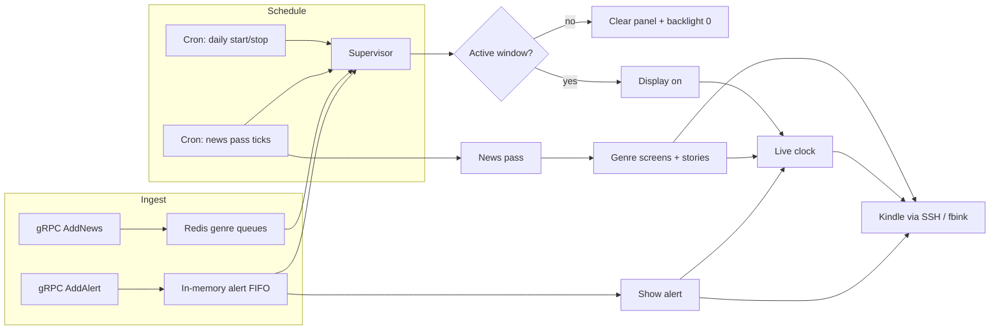
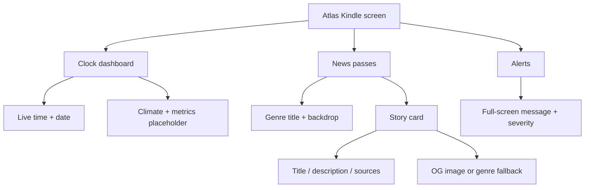
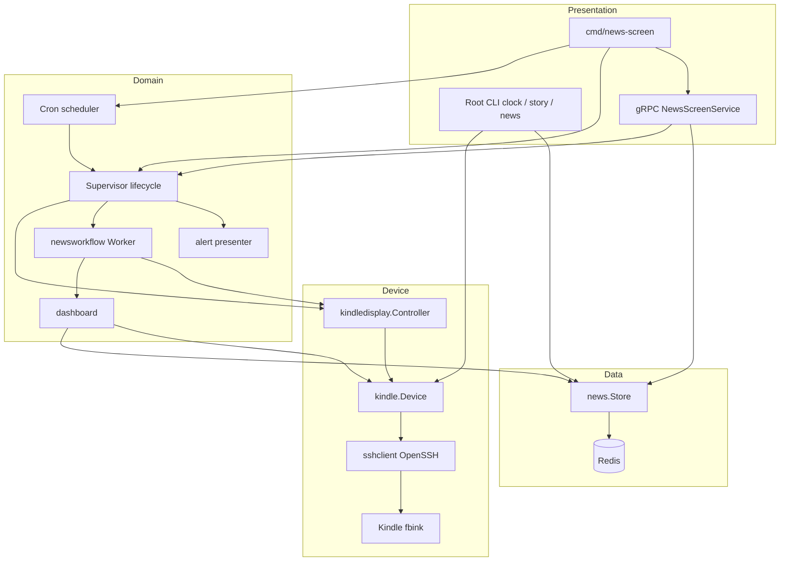

<div align="center">

# Atlas

**Turn a jailbroken Kindle into a scheduled news and clock display**

Atlas drives an e-ink Kindle over SSH: a live clock by default, genre-wise news passes on a wall-clock cadence (every 15 minutes by default), and interruptible alerts—all orchestrated as a long-running service with a gRPC API.

[](https://go.dev/)
[](https://grpc.io/)
[](https://redis.io/)
[](#architecture)
[](LICENSE)

</div>

---

## Overview

Atlas accepts news stories and short alerts, stores stories in Redis by genre, and paints them on a jailbroken Kindle over SSH. During the active daily window the device shows a live clock; on each configured wall-clock boundary it runs a genre-wise news pass (title screens, then stories with photo backgrounds), then restores the clock. Alerts can pause news, display a message for a fixed duration, and release the display back to the normal lifecycle. The result is a wall-mounted editorial screen that updates without apps, browsers, or a continuous GUI process on the Kindle itself.

The primary long-running binary is `cmd/news-screen`: timezone-aware cron scheduling, a single-owner lifecycle supervisor, and a gRPC API for news, alerts, and status. A simpler root CLI (`app.go`) supports one-shot `clock`, `story`, and continuous `news` modes for development and manual control. Rendering uses [fbink](https://github.com/NiLuJe/FBInk) on the device; the host uses system OpenSSH (not a pure-Go dial) so macOS LaunchAgents can reach LAN Kindles. Layouts are resolution-relative so the same code can target different Kindle panel sizes.

## By the numbers

Compact proof points taken from code defaults plus one live measurement on the development setup—no invented users:

| Dimension | Figure | Source |
| --- | --- | --- |
| Automation frequency | **64 scheduled news passes/day** (every 15 min across the 07:00–23:00 window) | `-news-refresh 15m` + scheduler cron |
| Screen throughput | Up to **44 screens/pass** (4 genres × 1 title + 10 stories) ≈ **2,800 paints/day** fully stocked; worst-case pass ≈ 7 min 20 s, fitting the 15-min slot with headroom | `-news-per-genre`, `-genre-hold`, `-story-hold` |
| Clock duty cycle | Minute-boundary repaint with a single non-flashing GC16 regional refresh—up to **960 paints/day** when idle | `internal/kindle/clock.go` |
| Measured latency | **~330 ms SSH round-trip** host→Kindle for a trivial command over LAN OpenSSH | live measurement (PaperWhite 3, 1448×1072 @ 300 DPI, fbink v1.25.0) |
| Data volume | Genre queues retain **100 stories each** with a **24 h dedupe TTL** (atomic Lua `SET NX EX`); dead-letter list capped at 100 | `internal/news/store.go` |
| Image pipeline | 12 MiB max download, 15 s fetch timeout, ≤5 redirects re-validated for SSRF, 40 MP decode guard, 128-image / 64 MiB prep cache | `internal/kindle/story.go` |
| Alert path | FIFO of **100**, 30 s on-screen, 2 s clear budget, preempts an in-flight pass within the 5 s worker-stop timeout | supervisor config |
| Failure policy | Display start retries **3× (1 s → 2 s → 4 s)**; worker failures back off exponentially from 1 s to a **60 s cap** | `internal/supervisor` |
| Concurrency budget | Single-owner supervisor loop, **256-slot command queue**, buffer-1 coalescing so overlapping ticks collapse into one follow-up pass, 32 concurrent gRPC streams | `internal/supervisor`, `cmd/news-screen/main.go` |
| API guardrails | Default 30 s RPC deadline, bearer tokens ≥32 chars compared constant-time, TLS ≥1.2 off-loopback, field caps (title 512 B, description 4 KB, ≤10 sources) | `internal/grpcserver` |
| Unattended operation | **16 h/day active window**; outside it the panel is cleared and backlight forced to 0; graceful SIGTERM blanking—no always-on GUI process on the Kindle itself | scheduler + kindledisplay controller |
| Test & CI surface | **63 test functions across 14 files**; CI gates gofmt, vet, unit + race + coverage against Redis 7, govulncheck, and generated-proto drift | repo tree, `.github/workflows/ci.yml` |

*Daily totals are derived from defaults assuming fully stocked queues; the latency figure is a real measurement on the target device.*

## Features

| Area | What the project provides |
| --- | --- |
| **Scheduled display window** | Daily start/stop in a configured timezone (default 07:00–23:00 Asia/Kolkata). Outside the window the panel is cleared and backlight is set to 0. |
| **Clock as default UI** | Live `HH:MM` clock with date chrome; minute-boundary updates use a single non-flashing GC16 regional refresh to limit ghosting. |
| **Genre-wise news passes** | Wall-clock cron (default every 15 minutes at `:00/:15/:30/:45`) walks Redis genres: genre title screen, then up to N stories per genre (default 10), each held for a configurable duration. |
| **Story presentation** | Editorial layout: genre label, title, description, source domains. Prefers Open Graph images as full-screen backgrounds; falls back to genre assets under `assets/genres`. Story image fetches require public HTTPS by default (SSRF-safe); `-image-allow-private` is opt-in for trusted private hosts. |
| **Redis news queues** | Normalized genre queues are bounded (`-news-queue-limit`, default 100), deduplicated for 24 hours, rotated with LMOVE, and protected by a poison-item dead letter. Optional `-redis-password-file`, `-redis-db`, and `-redis-prefix` for auth, database selection, and key namespacing. |
| **gRPC API** | `AddNews`, `AddAlert`, and `GetStatus` (lifecycle, desired-on, worker flags, queue depth, last error/timestamps), plus standard gRPC health. Field validation, operation IDs / `CommandState`, alert `Severity`, structured logging, panic recovery, deadlines, bearer auth, and TLS/mTLS. |
| **Alert FIFO** | Bounded in-memory queue (default capacity 100). Alerts carry severity (`info` / `warning` / `critical`), interrupt news, display for a fixed duration (default 30s), then resume the lifecycle. Rejected when full or when the service is shutting down. |
| **Lifecycle supervisor** | Single-owner state machine (`off` → `starting` → `running` / `pausing` / `alerting` → `stopping` / `failed`) owns display power, news worker, and alert presentation—no competing writers. Start failures retry with backoff. |
| **CLI modes** | Root binary: `clock`, `story` (JSON from file or stdin), and `news` (continuous Redis-driven loop) for local control without the full service. Shares SSH/Redis/image policy flags with the service. |
| **Device control over SSH** | Rotation, backlight, clear, text, and image upload via system OpenSSH + fbink. Strict host-key verification via `known_hosts` by default; user, key path, and known-hosts file are configurable. Startup fails fast if the Kindle is unreachable. |

> [!NOTE]
> **Completed:** news-screen service (scheduler, supervisor, gRPC with `GetStatus`/severity), Redis news store (prefix/limit options), genre/story painting with public-image policy, clock default between passes, alert queue, OpenSSH host-key controls, bearer/TLS hardening for non-loopback gRPC, CLI modes, CI, and unit/integration tests for core packages.
>
> **Partial / placeholder:** clock dashboard climate and metric columns show `--` until a `MetricsProvider` is wired to live sensors.
>
> **Operational gaps (by design or deferred):** alert FIFO is in-memory only—accepted but unfinished alerts are lost on process crash; scheduled desired-on state is reconstructed from the clock on every boot.

## From input to result



News passes are signal-driven, not busy-polled: the worker idles on a live clock until a pass signal arrives (cron tick or `NotifyNewsChanged` after `AddNews`). If a tick arrives while a pass is still running, the signal is coalesced so one follow-up pass runs after the current cycle ends and the clock is restored briefly. Alerts preempt news by cancelling the news worker, waiting for a clean stop (with a worker-stop timeout), then presenting the alert head of the FIFO. Display start retries with backoff on failure.

## Product surface

What the Kindle actually shows, organized by product concern rather than packages:



Genre backdrop files ship under `assets/genres` (`india`, `mumbai`, `world`, `misc`; matching is case-insensitive; unknown genres use `misc`).

## Architecture



**Conventions that matter in this codebase:**

- **Single owner for lifecycle:** only the supervisor mutates display/news/alert run state via a command channel; external callers (`Reconcile`, `AddAlert`, cron hooks) send commands and wait for replies.
- **Interfaces at the edges:** `display.Controller`, `newsworker.Worker`, and `alert.Presenter` keep device and refresh strategies swappable for tests.
- **Redis is the news source of truth;** alerts are intentionally not durable.
- **SSH via system OpenSSH** (not a pure-Go SSH stack) so LaunchAgents on macOS can reach LAN hosts without a Go TCP dial (which hits Local Network TCC restrictions). Host keys are verified against `known_hosts` unless `-ssh-insecure-host-key` is set for local development.
- **gRPC interceptors** apply a default timeout when the client omits a deadline, log request IDs, recover panics, and optionally enforce bearer tokens (`-grpc-token-file`, minimum 32 characters). Non-loopback binds also require TLS and either a bearer token or mTLS (`-grpc-client-ca`).
- **Story image fetches** validate public destinations (and re-check redirects) unless `-image-allow-private` is enabled.
- **Protobuf is generated** into `gen/`; edit `api/proto` and regenerate—do not hand-edit stubs.

## Tech stack

| Layer | Technology |
| --- | --- |
| Language | [Go](https://go.dev/) 1.26 (module `github.com/aneeshpatne/atlas`) |
| API | [gRPC](https://grpc.io/) + [Protocol Buffers](https://protobuf.dev/) (`google.golang.org/grpc`, `protobuf`) |
| Persistence | [Redis](https://redis.io/) via [go-redis/v9](https://github.com/redis/go-redis) |
| Scheduling | [robfig/cron/v3](https://github.com/robfig/cron) (timezone-aware) |
| Device transport | System OpenSSH only (`/usr/bin/ssh` preferred, `PATH` fallback)—no pure-Go SSH library |
| Imaging | [golang.org/x/image](https://pkg.go.dev/golang.org/x/image) (JPEG/GIF/WebP decode, story background prep, e-ink tone mapping) |
| On-device UI | [fbink](https://github.com/NiLuJe/FBInk) over SSH; Instrument Serif / Helvetica fonts on the Kindle |
| Logging | `log/slog` JSON handler in the service binary |
| CI | GitHub Actions: `gofmt`, `go vet`, unit/race/coverage tests (Redis service), `govulncheck`, generated-proto drift check |
| Testing | Go standard library `testing` (unit + opt-in Redis integration via `ATLAS_TEST_REDIS_ADDR`) |

## Project structure

```text
.
├── app.go                      # CLI: clock | story | news
├── cmd/news-screen/            # Long-running service entrypoint
│   ├── main.go
│   ├── main_test.go
│   └── README.md               # Service-specific flags and lifecycle notes
├── api/proto/screen/v1/        # Protobuf sources (news, alerts, status)
├── gen/screen/v1/              # Generated pb / gRPC stubs
├── assets/genres/              # Genre backdrop images (india, mumbai, world, misc)
├── .github/workflows/ci.yml    # Format, vet, test, race, coverage, vuln, proto check
├── internal/
│   ├── config/                 # Defaults, validation, timeouts
│   ├── supervisor/             # Single-owner lifecycle state machine
│   ├── scheduler/              # Daily window + news-pass cron specs
│   ├── grpcserver/             # RPC handlers, bearer auth, unary interceptors
│   ├── news/                   # Redis store (prefix/limit options) and Story types
│   ├── screennews/             # Protobuf-to-domain Redis ingestion adapter
│   ├── dashboard/              # Genre cycles and story draining
│   ├── newsworkflow/           # Clock-default loop + pass signals
│   ├── newsworker/             # Supervisor-facing worker interface
│   ├── kindle/                 # Device commands, clock, story, genre paint
│   ├── kindledisplay/          # display.Controller + alert presenter
│   ├── display/                # Controller interface
│   ├── alert/                  # Alert model (severity) and timed presentation
│   ├── sshclient/              # OpenSSH wrapper (context APIs, known_hosts)
│   └── redis/                  # Thin Redis client
└── story.json                  # Sample story payload for CLI story mode
```

## Requirements

- **Go** 1.26+ (module declares `go 1.26.4`)
- **Redis** reachable at the address you pass (default `localhost:6379`)
- **Jailbroken Kindle** (tested on a PaperWhite 3, 1448×1072 @ 300 DPI, fbink v1.25.0) with:
  - SSH reachable at the configured address (default `192.168.0.10:22`) and user (default `root` via `-ssh-user`)
  - Private key at `~/.ssh/id_ed25519` by default (`-ssh-key`)
  - A matching entry in `~/.ssh/known_hosts` by default (`-ssh-known-hosts`); use `-ssh-insecure-host-key` only for local development
  - [fbink](https://github.com/NiLuJe/FBInk) at `/mnt/us/usbnet/bin/fbink`
  - Fonts used by rendering (e.g. `/mnt/us/fonts/InstrumentSerif-Regular.ttf`, optional Helvetica under `/usr/java/lib/fonts/`)
- **Network access** from the host to the Kindle (LAN); for story backgrounds, outbound HTTPS to fetch **public** Open Graph images (private/link-local destinations are blocked unless `-image-allow-private` is set)
- **Genre assets directory** (default `assets/genres`) present when running news-screen
- **Optional secrets as files:** Redis password (`-redis-password-file`) and gRPC bearer token (`-grpc-token-file`) must be readable files; the service rejects world/group-readable secret files

**Not required for unit tests:** a physical Kindle or Redis (tests use fakes and pure logic). **Required for real display:** reachable Kindle + key; **for news mode / service:** Redis as well. Set `ATLAS_TEST_REDIS_ADDR` to exercise the Redis integration test. The service is intended to run on a host machine that keeps SSH open to the device, not on the Kindle itself.

## Getting started

1. **Clone the repository**

   ```bash
   git clone https://github.com/aneeshpatne/atlas.git
   cd atlas
   ```

2. **Install dependencies**

   ```bash
   go mod download
   ```

3. **Ensure Redis is running** (news mode and the service)

   ```bash
   redis-cli ping   # expect PONG
   ```

4. **Confirm SSH to the Kindle**

   ```bash
   ssh -i ~/.ssh/id_ed25519 root@192.168.0.10 true
   ```

5. **Run the full news-screen service**

   ```bash
   go run ./cmd/news-screen \
     -kindle-address 192.168.0.10:22 \
     -ssh-user root \
     -ssh-key ~/.ssh/id_ed25519 \
     -ssh-known-hosts ~/.ssh/known_hosts \
     -redis localhost:6379 \
     -timezone Asia/Kolkata \
     -grpc 127.0.0.1:50050 \
     -news-refresh 15m \
     -news-per-genre 10 \
     -news-queue-limit 100 \
     -assets assets/genres
   ```

   Optional hardening / multi-tenant Redis:

   ```bash
   go run ./cmd/news-screen \
     -kindle-address 192.168.0.10:22 \
     -redis redis.example:6379 \
     -redis-password-file /run/secrets/redis_password \
     -redis-db 1 \
     -redis-prefix atlas:prod: \
     -grpc 0.0.0.0:50050 \
     -grpc-tls-cert /etc/atlas/tls.crt \
     -grpc-tls-key /etc/atlas/tls.key \
     -grpc-token-file /run/secrets/grpc_token \
     -assets assets/genres
   ```

6. **Or use the CLI for a single mode**

   ```bash
   # Live clock
   go run . -address 192.168.0.10:22 clock

   # One story from JSON
   go run . -address 192.168.0.10:22 -story-file story.json story

   # Continuous news loop from Redis
   go run . -address 192.168.0.10:22 -redis localhost:6379 news
   ```

7. **Regenerate protobuf stubs** (after editing protos)

   ```bash
   PATH="$(go env GOPATH)/bin:$PATH" go generate ./api/proto
   ```

> [!IMPORTANT]
> gRPC binds to `127.0.0.1:50050` by default. A non-loopback bind requires **TLS** plus either `-grpc-token-file` (token ≥ 32 characters) or mutual TLS (`-grpc-client-ca`). SSH host verification is strict by default (`-ssh-known-hosts`); `-ssh-insecure-host-key` disables it for development only. Story image downloads reject private/local destinations unless `-image-allow-private` is set.

## Running tests

**Command line** (from the repository root):

```bash
go test ./...
```

Run a single package with verbose output:

```bash
go test ./internal/supervisor -v
go test ./internal/kindle -count=1
```

**What the suite covers:** config and scheduler behavior; supervisor FIFO, cancellation, backoff, and shutdown; gRPC validation, bearer auth, `GetStatus`, and error mapping; newsworkflow signaling; backdrop/story rendering and public-image policy; SSH quoting, host/port validation, and context cancellation; and opt-in Redis integration (prefix/limit/dedupe). Set `ATLAS_TEST_REDIS_ADDR` (for example `127.0.0.1:6379`) to run the Redis integration test locally.

GitHub Actions (`.github/workflows/ci.yml`) runs formatting, vet, unit tests against a Redis service, the race detector, coverage, `govulncheck`, and a generated-protobuf drift check.

## Roadmap

- Wire a live sensor implementation into the clock's `MetricsProvider` interface.
- Optional durable alert queue so accepted alerts survive process restarts.
- End-to-end tests against a complete fake Kindle/fbink environment.

## License

This project is licensed under the [Apache License 2.0](LICENSE).

You may use, modify, and redistribute the software, including in commercial products, provided you include a copy of the license, state significant changes to modified files, and retain existing copyright and attribution notices. Contributions are accepted under the same terms unless otherwise stated. The software is provided on an “AS IS” basis, without warranties. The patent grant terminates if you initiate patent litigation over the work.

---

<div align="center">
  Built in Go for Redis-backed news and SSH-driven Kindle e-ink—quiet by default, loud when it matters.
</div>
